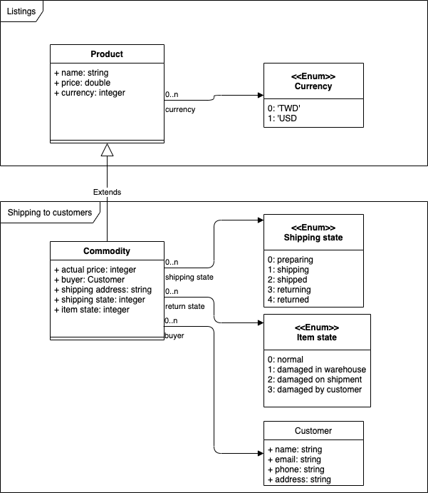
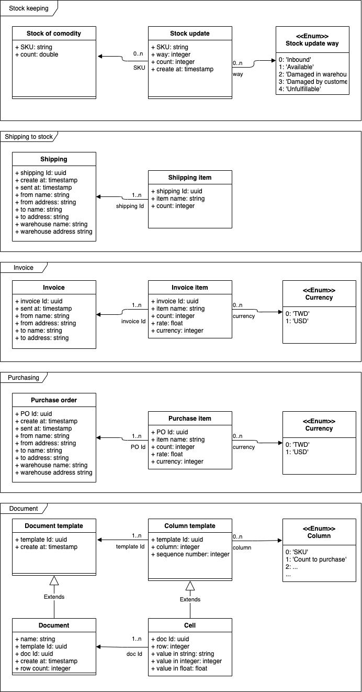

# enterprice 企業系統
本目錄存放之前上班公司所做的 ERP 系統的重現。

### 權則聲明
本作品概念或許由之前上班的公司獲得或啟發，但是，概念沒有專利權。我的重現是在回想的印象基礎之上重新創作，用意只在於展示以我的智慧能力能怎麼樣做出同樣的作品。

## 基本配置
- 工具
  - .NET Core
  - Razor Pages
  - SignalR
  - Docker
  - docker-compose
  - skaffold

## 系統情境
相較於本系統，有個外站為大宗商務平台。外站提供限流式網路服務，即限制存取次數的 API ；藉由 API ，外站提供主流商務內容如上架商品、存貨更新、代營銷數據等資訊服務。

本系統為一套企業資源規劃系統，與外站介接資源，並滿足進、銷、存、管等四項主流功能。

## 架構
| 配置 | 功能 | 類型 | 技術工具 |
| ---- | ---- | ---- | -------- |
| 前端 | 庫存報告 銷售紀錄 採購規劃 管理資訊 | 網站服務 | [.NET 5.0 SDK 5.0.300](https://dotnet.microsoft.com/download/dotnet/5.0) [C# 9.0](https://docs.microsoft.com/en-us/dotnet/csharp/) [Razor Pages](https://docs.microsoft.com/en-us/aspnet/core/razor-pages/?view=aspnetcore-5.0&tabs=visual-studio) [Docker](https://www.docker.com/get-started) |
| 外站 | 限流式網路服務 | API | [Spring Boot](https://spring.io/projects/spring-boot) [Docker](https://www.docker.com/get-started) |
| 外來資訊端 | 外站資源介接 | 服務 | [ProtoBuf](https://developers.google.com/protocol-buffers) [gRPC](https://grpc.io/docs/) [Spring Boot](https://spring.io/projects/spring-boot) [Docker](https://www.docker.com/get-started) |
| 後端 | 商業邏輯管控 系統模式 | 服務 | [Erlang](https://erlang.org/doc/search/) [OTP](https://github.com/Erlang/OTP) [`rpc`](https://erlang.org/doc/man/rpc.html) [Docker](https://www.docker.com/get-started) |

###### 功能拆解的想法
傳統 Web framework 例如 MVC 給我們的感覺：可能單體感較強，在架構需求不高的情況下，往往一套網站內容夾帶了全部的系統堆疊，從 HTTP 請求一路下到資料存取。用太過簡單的講法來說，其實一套應用軟體，不就是給了限定的輸入之後而得了合理的輸出，這麼簡單的事了嗎？

接著上述例子，寫多了 MVC / C# 的程式，便發現其實每一條程式調用的路徑，由 HTTP 請求開始一路調用各式各樣的函式，每一路程式都能受到區隔；如果有共用的模組，就視為將模組的程式碼給每一路複製一份。

———那麼，可發現每一路程式自成一條 silo ，所謂筒倉或獨立筒。筒倉林立在於訴求倉儲存取的效率，或者在於倉儲內容物的區隔。以同樣的典範思考， Docker 容器化技術在於訴求後端服務甚至資料的區隔，一方面由外方看，容器林立代表部門清晰、涇渭分明，而另一方面，容器內的程式與資料走向意義精粹，適合於專精發展。

對照來看，將前端的幾大功能視為介面與映像，則功能的實體皆在於後端（含上表所提的外站、後端、外來資訊端等）分化為豐富甚至繁雜的各部門。

###### 功能拆解
| 部門 | 功能 | 專案位置 | 概述 |
| ---- | ---- | -------- | ---- |
| 商品進出 | 包含商品目錄與進、銷、存 |  | - 更新商品目錄 - 更新銷售紀錄 - 添加採購紀錄 資料層 #1 |
| 業務文件 | 提供表格文件功能 |  | - 定義表格格式 - 提供欄位選取 資料層 #2 |
| 採購規劃表 | 提供營運資料的表格化 | https://github.com/YauHsien/accounting/v0 | - 開列表格 - 篩選欄位 - 指定本地或外埠 - 簽核 - 轉錄到商品進出 資料層 #1 |
| 會計帳 | 管控自動化的會計帳結構 |  | - 定義通用會計格式 - 帳務結構模型 資料層 #3 |
| 成員 | 提供人員的進場、出場與通訊 |  | 資料層 #4 |
| 工作管理 | 提供部門、所屬人員組織與任務表 |  | - 定義部門 - 將人員歸屬於部門 - 定義人員的職級 - 定義任務表含簽核欄位 資料層 #5 |

## 組織

產品清單與客戶銷售紀錄：由於外站主責代管銷售通路，本系統與之介接，只獲得最終銷售紀錄，因此資料呈現較為平板化。如圖，
- Class `Product` 是產品清單項目，定義了品名與定價。
- Class `Commodity` 代表每一件具體的貨品，除了有定價之外，還有成交價 `actual price` 、配送結果與物品狀態

本系統主責為銷售後勤系統，結構大都為了補充存貨，而由文件式採購計畫而產生採購單，收錄發票，規劃貨運入庫。如圖，

會計系統，相較於本系統及其他各系統，為中立的服務單位。本系統只需藉由 API 將傳票與憑證傳遞給會計系統，並且提交帳項，而會計部門須關心是否認列。

會計服務另列[專案位置](https://github.com/YauHsien/accounting/v0)。
